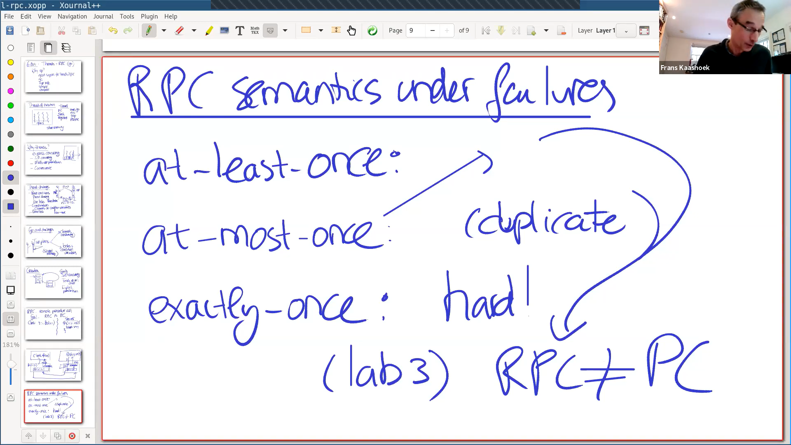

## Lec1

- Go
  - 
  - 
  
- Vote example

  - solution 1: using locks (see *vote-count-4.go*)

    - cons: same as solution 2 below, since `cond.Broadcast()` use channels to communicate

    - ```go
      func main() {
      	rand.Seed(time.Now().UnixNano())
      
      	count := 0
      	finished := 0
      	var mu sync.Mutex
      	cond := sync.NewCond(&mu)
      
      	for i := 0; i < 10; i++ {
      		go func() {
      			vote := requestVote()
      			mu.Lock()
      			defer mu.Unlock()
      			if vote {
      				count++
      			}
      			finished++
      			cond.Broadcast()
      		}()
      	}
      
      	mu.Lock()
      	for count < 5 && finished != 10 {
      		cond.Wait()
      	}
      	if count >= 5 {
      		println("received 5+ votes!")
      	} else {
      		println("lost")
      	}
      	mu.Unlock()
      }
      
      func requestVote() bool {
      	time.Sleep(time.Duration(rand.Intn(100)) * time.Millisecond)
      	return rand.Int() % 2 == 0
      }
      ```

  - solution 2: using channels (see *vote-count-5.go*)

    - cons: once the main goroutine ends the others would be blocked

    - ```go
      func main() {
      	rand.Seed(time.Now().UnixNano())
      
      	count := 0
      	finished := 0
      	ch := make(chan bool)
      	for i := 0; i < 10; i++ {
      		go func() {
      			ch <- requestVote()
      		}()
      	}
      	for count < 5 && finished < 10 {
      		v := <-ch
      		if v {
      			count += 1
      		}
      		finished += 1
      	}
      	if count >= 5 {
      		println("received 5+ votes!")
      
      	} else {
      		println("lost")
      	}
      }
      
      func requestVote() bool {
      	time.Sleep(time.Duration(rand.Intn(100)) * time.Millisecond)
      	return rand.Int()%2 == 0
      }
      ```

- Crawler example (see *Crawler.go*)

  - Concurrent crawler with shared state and Mutex

    - use locks when reading and writing the map

    - ```go
      type fetchState struct {
      	mu      sync.Mutex
      	fetched map[string]bool
      }
      
      func ConcurrentMutex(url string, fetcher Fetcher, f *fetchState) {
      	f.mu.Lock()
      	already := f.fetched[url]
      	f.fetched[url] = true
      	f.mu.Unlock()
      
      	if already {
      		return
      	}
      
      	urls, err := fetcher.Fetch(url)
      	if err != nil {
      		return
      	}
      	var done sync.WaitGroup
      	for _, u := range urls {
      		done.Add(1)
      		//u2 := u
      		//go func() {
      		// defer done.Done()
      		// ConcurrentMutex(u2, fetcher, f)
      		//}()
      		go func(u string) {
      			defer done.Done()
      			ConcurrentMutex(u, fetcher, f)
      		}(u)
      	}
      	done.Wait()
      	return
      }
      
      func makeState() *fetchState {
      	f := &fetchState{}
      	f.fetched = make(map[string]bool)
      	return f
      }
      ```

  - Concurrent crawler with channels

    - MapReduce-like idea: there is a coordinator and many workers

      - coordinator responsible for assigning tasks to workers
      - workers responsible for fetching urls in the given url

    - use a variable `n` to track the remaining number of goroutines 

    - ```go
      func worker(url string, ch chan []string, fetcher Fetcher) {
      	urls, err := fetcher.Fetch(url)
      	if err != nil {
      		ch <- []string{}
      	} else {
      		ch <- urls
      	}
      }
      
      func coordinator(ch chan []string, fetcher Fetcher) {
      	n := 1
      	fetched := make(map[string]bool)
      	for urls := range ch {
      		for _, u := range urls {
      			if fetched[u] == false {
      				fetched[u] = true
      				n += 1
      				go worker(u, ch, fetcher)
      			}
      		}
      		n -= 1
      		if n == 0 {
      			break
      		}
      	}
      }
      
      func ConcurrentChannel(url string, fetcher Fetcher) {
      	ch := make(chan []string)
      	go func() {
      		ch <- []string{url}
      	}()
      	coordinator(ch, fetcher)
      }
      ```

- RPC

  - 
  - 

- KV server example (see *kv.go*)

  - ```go
    //
    // Client
    //
    
    func connect() *rpc.Client {
    	client, err := rpc.Dial("tcp", ":1234")
    	if err != nil {
    		log.Fatal("dialing:", err)
    	}
    	return client
    }
    
    func get(key string) string {
    	client := connect()
    	args := GetArgs{key}
    	reply := GetReply{}
    	err := client.Call("KV.Get", &args, &reply)
    	if err != nil {
    		log.Fatal("error:", err)
    	}
    	client.Close()
    	return reply.Value
    }
    
    func put(key string, val string) {
    	client := connect()
    	args := PutArgs{key, val}
    	reply := PutReply{}
    	err := client.Call("KV.Put", &args, &reply)
    	if err != nil {
    		log.Fatal("error:", err)
    	}
    	client.Close()
    }
    
    //
    // Server
    //
    
    type KV struct {
    	mu   sync.Mutex
    	data map[string]string
    }
    
    func server() {
    	kv := new(KV)
    	kv.data = map[string]string{}
    	rpcs := rpc.NewServer()
    	rpcs.Register(kv)
    	l, e := net.Listen("tcp", ":1234")
    	if e != nil {
    		log.Fatal("listen error:", e)
    	}
    	go func() {
    		for {
    			conn, err := l.Accept()
    			if err == nil {
    				go rpcs.ServeConn(conn)
    			} else {
    				break
    			}
    		}
    		l.Close()
    	}()
    }
    
    func (kv *KV) Get(args *GetArgs, reply *GetReply) error {
    	kv.mu.Lock()
    	defer kv.mu.Unlock()
    
    	val, ok := kv.data[args.Key]
    	if ok {
    		reply.Err = OK
    		reply.Value = val
    	} else {
    		reply.Err = ErrNoKey
    		reply.Value = ""
    	}
    	return nil
    }
    
    func (kv *KV) Put(args *PutArgs, reply *PutReply) error {
    	kv.mu.Lock()
    	defer kv.mu.Unlock()
    
    	kv.data[args.Key] = args.Value
    	reply.Err = OK
    	return nil
    }
    
    //
    // main
    //
    
    func main() {
    	server()
    
    	put("subject", "6.824")
    	fmt.Printf("Put(subject, 6.824) done\n")
    	fmt.Printf("get(subject) -> %s\n", get("subject"))
    }
    ```

    